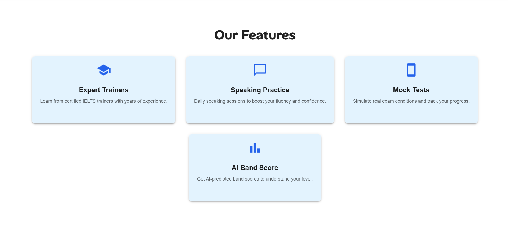
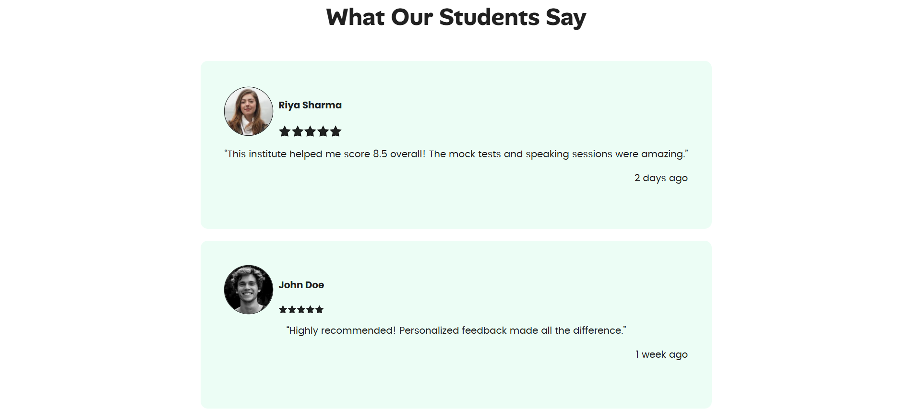
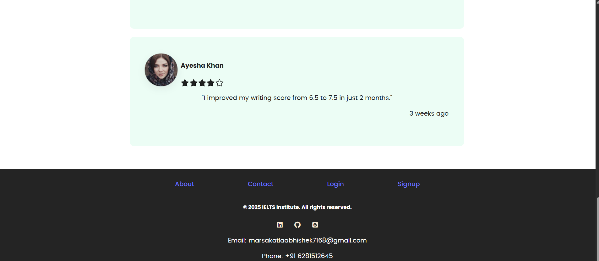
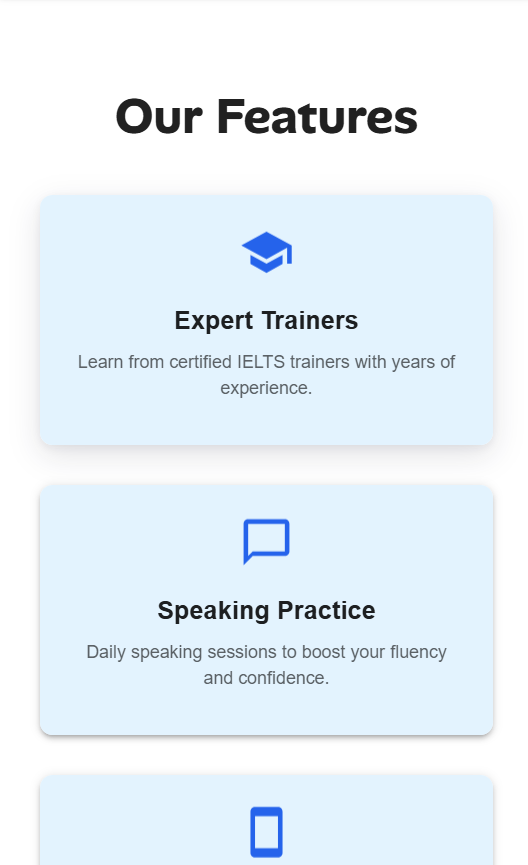
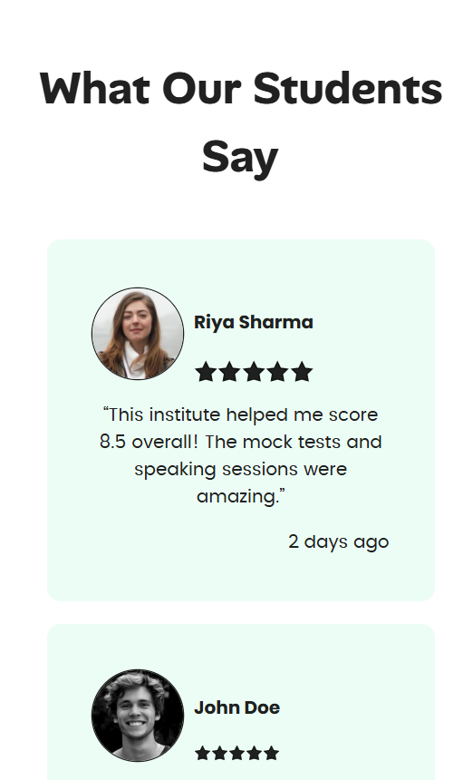
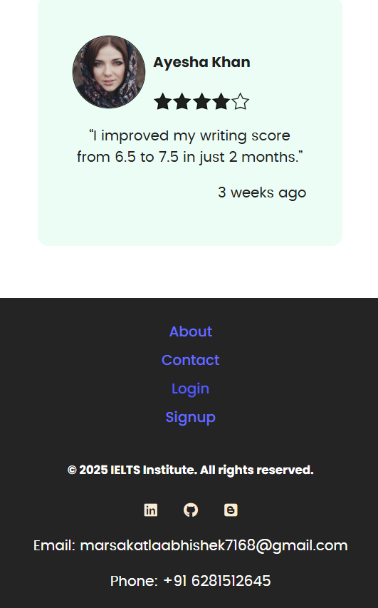

# IELTS Institute Home Page (React JS)

A modern and responsive home page for a fictional IELTS Institute built with **React JS** and styled using **CSS & Tailwind**.  
This project was created as part of an assignment with a focus on **UI/UX quality**.

---

## Live Demo
[visit](https://baby-code-home-page.vercel.app/)
---

## Screenshots

### Desktop View

###Home


###Features


##Testimonials


##Footer


##

### Mobile View


###Features


##Testimonials


##Footer


---

## 🛠 Features
- **Navbar** with logo and menu links  
- **Hero section** with headline, subtext, CTA button, and banner image  
- **Feature cards** (Speaking Practice, Mock Tests, AI Band Score, etc.)  
- **Student testimonials** (2–3 reviews)  
- **Footer** with links, contact info, and social icons  
- **Responsive design** (works on phones and desktops)  

---

## ⚡ Setup Instructions
If you want to run this locally:
```bash
# Clone the repo
git clone https://github.com/your-username/ielts-institute-homepage.git

# Navigate into folder
cd ielts-institute-homepage

# Install dependencies
npm install

# Start local dev server
npm run dev
